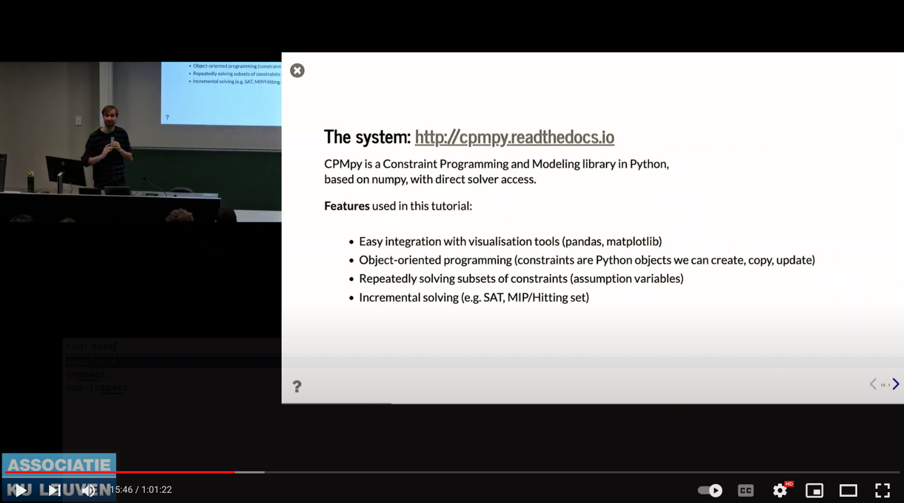

# Explainable Constraint Solving - A Hands-On Tutorial

### Authored by Ignace Bleukx, Dimos Tsouros and Tias Guns

This repository contains the code and runnable notebook for the Explainable Constraint Solving tutorial at the CP2023 conference.

Explainable constraint solving is a sub-field of explainable AI (XAI) concerned with explaining constraint (optimization) problems. 
Although constraint models are explicit: they are written down in terms of individual constraints that need to be satisfied, and the solution to such models can be non-trivial to understand.

Driven by the use-case of nurse scheduling, we demonstrate the type of questions a user can have about (non)-solutions, as well as reviewing what kind of computational tools are available today to answer such questions. 
We cover classical methods such as MUS/MCS extraction, and more recent advances in the field such as step-wise explanations, constraint relaxation methods, and counterfactual solutions.
We demonstrate and give special attention to techniques that we have successfully (re-)implemented on top of the CPMpy constraint-solving library, which can be readily used today.

The video of the presentation is made available here:
[](https://www.youtube.com/watch?v=V9DPHZq0gXk)

## Just browsing?

We uploaded the executed version of the slides in both `.pdf` and `.html` versions.

The slide-show can be run from browser by opening the `.html` version and using `Space` to go to the next slide, or by going to the following link:
https://raw.githack.com/CPMpy/CP23-tutorial/main/hands-on-tutorial.slides.html#/1

## How to run?

To run the `.ipynb` yourself, makes sure you install the following packages:
- CPMpy (>=v0.9.17)
- jupyter
- rise (to make the slideshow)
- faker (to create fake names for nurses)
- pandas (for visualizations)
- cpmpy on branch `constraint_name` for the descriptions of the constraints (this feature will soon be available in the pip version of CPMpy)

A one-liner to install pip-packages:

```bash
pip install cpmpy jupyter nbclassic rise faker pandas matplotlib
```

## Structure of the repository
```bash
.
├── Benchmarks                     # Nurse scheduling instances
├── explanations
│   ├── __init__.py
│   ├── counterfactual.py          # Counterfactual explanations [1]
│   ├── marco_mcs_mus.py           # MARCO enumeration algorithm [2]
│   ├── stepwise                   # Fork of the step-wise explanations repo [3]
│   └── subset.py                  # Code to find all kinds of subsets of constraints
├── factory.py                     # Wrapper for nsp
├── hands-on-tutorial slides.pdf   # Exectued version of the slides
├── hands-on-tutorial.ipynb        # Runnable version of the slides
├── hands-on-tutorial.slides.html  # .html version of the executed slides
├── img                            # Images used in the tutorial
├── read_data.py                   # Helper functions to read and wrangle NSP data
└── visualize.py                   # Helper functions for visualization of constraints and solutions
```

## References

> [1] Korikov, A., & Beck, J. C. (2021). Counterfactual explanations via inverse constraint programming. In 27th International Conference on Principles and Practice of Constraint Programming (CP 2021). Schloss Dagstuhl-Leibniz-Zentrum für Informatik.

> [2] Liffiton, M.H., & Malik, A. (2013). Enumerating infeasibility: Finding multiple MUSes quickly. In Proceedings of the 10th International Conference on Integration of AI and OR Techniques in Constraint Programming (CPAIOR 2013) (pp. 160–175)

> [3] Bleukx, I., Devriendt, J., Gamba, E., Bogaerts B., & Guns T. (2023). Simplifying Step-wise Explanation Sequences. In International Conference on Principles and Practice of Constraint Programming 2023
